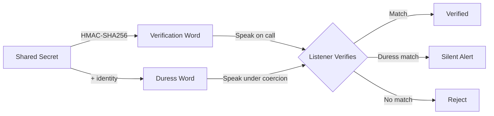
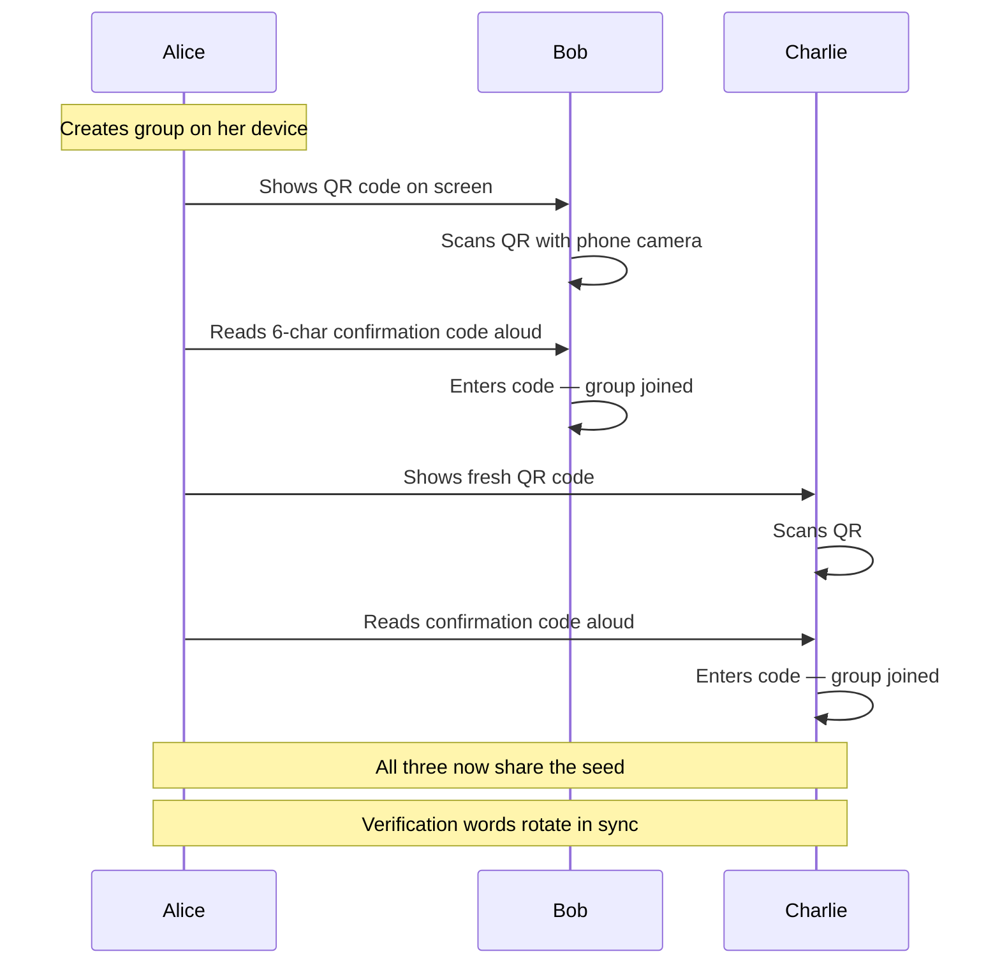
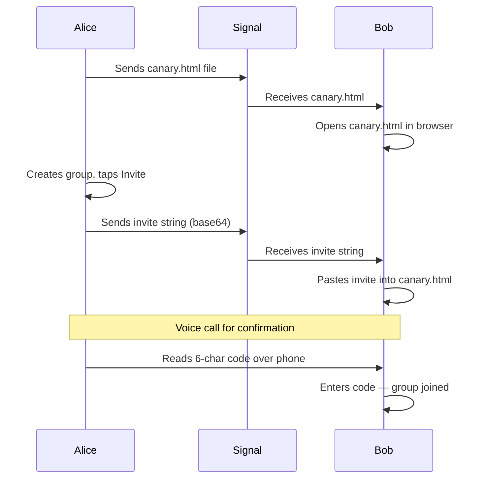
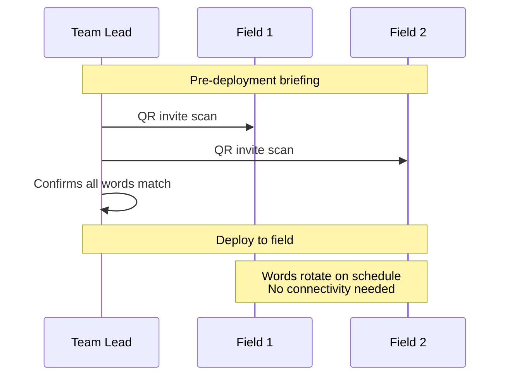
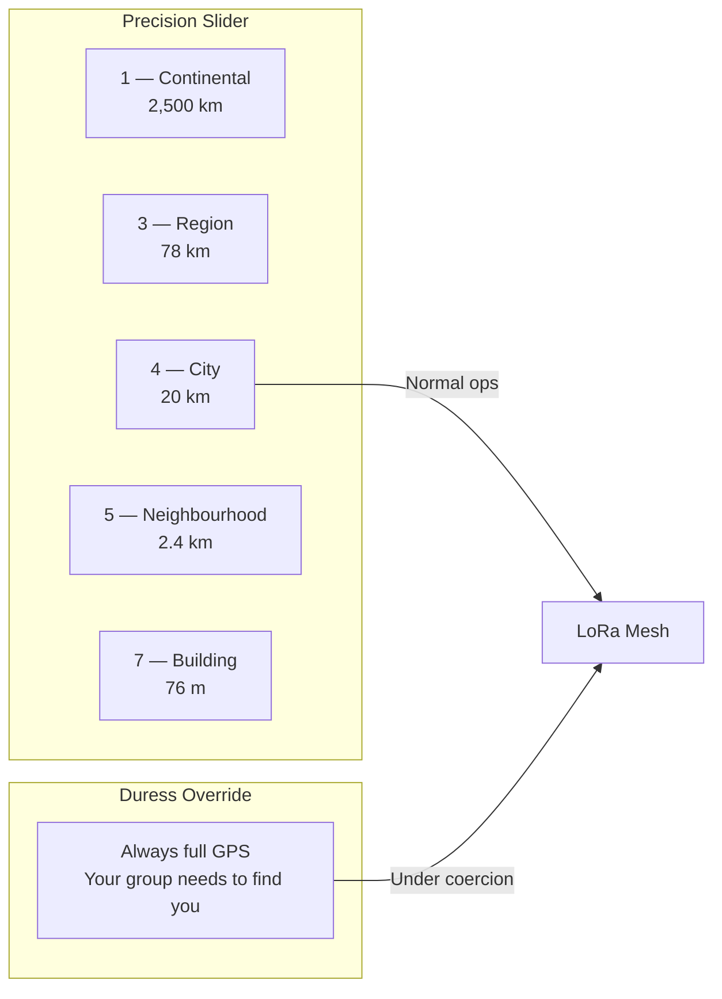
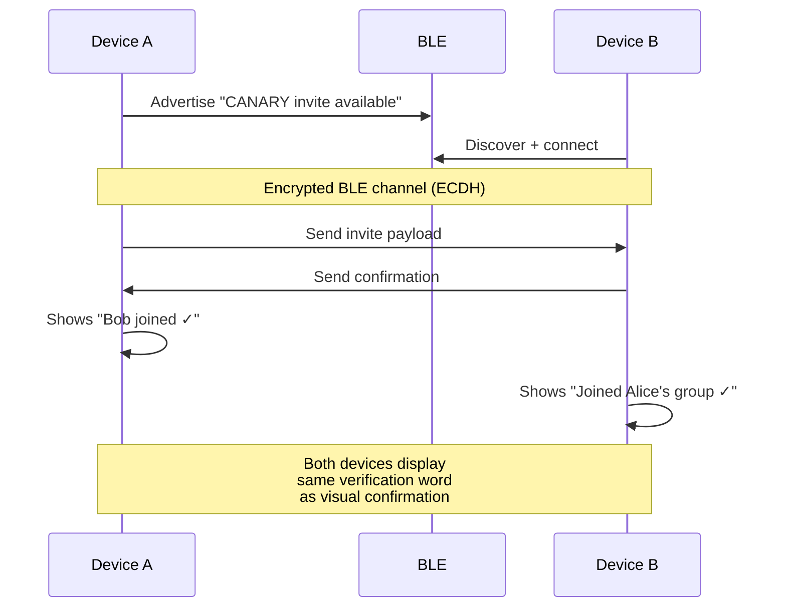
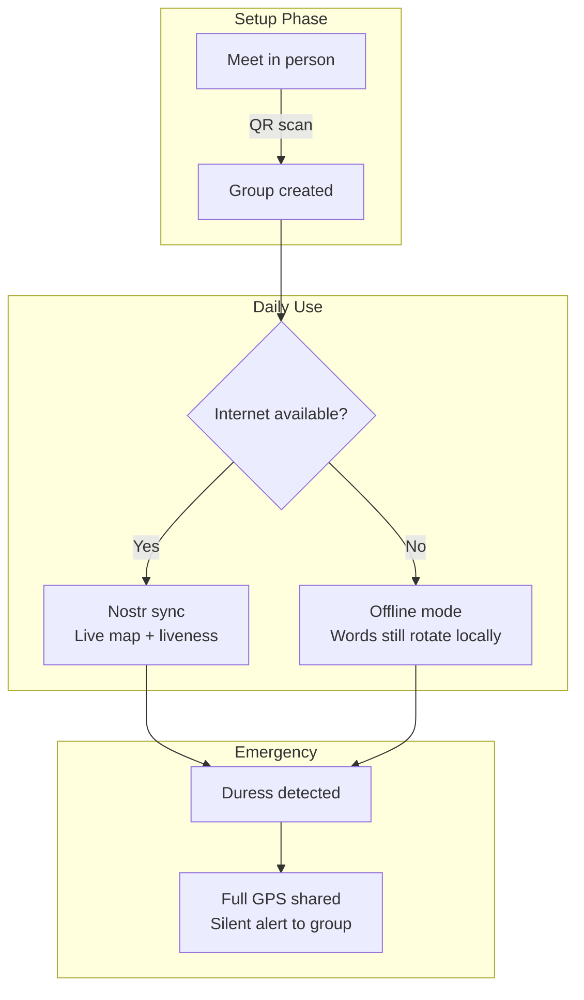
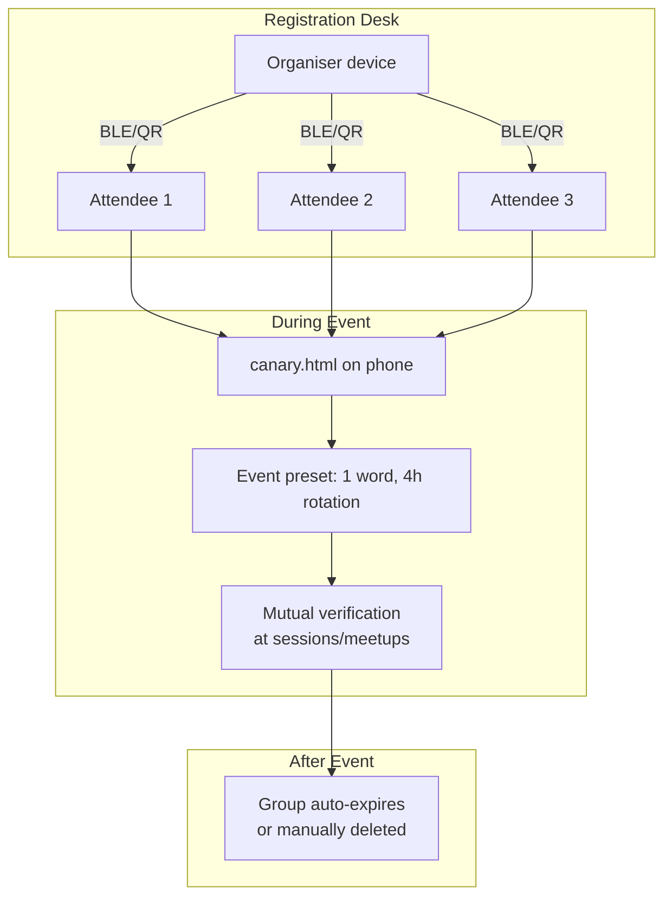
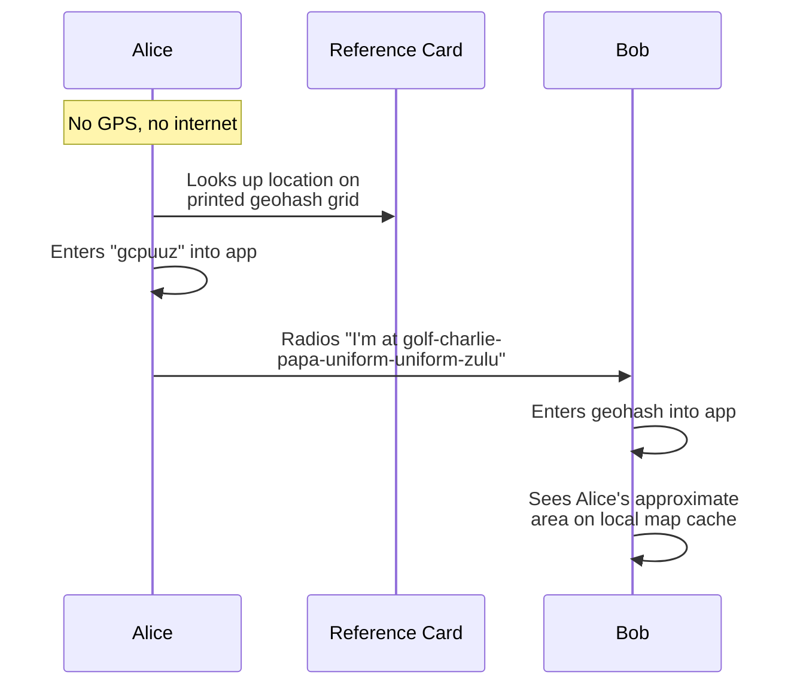

# CANARY Protocol — Transport Walkthrough

CANARY is **transport-agnostic**. The core protocol (derive, verify, duress) runs entirely offline — it's pure maths. Only group setup and optional sync need a channel. This document walks through how CANARY can be deployed across different real-world transports.

## How It Works (30 Seconds)



Everyone in the group shares a secret seed. From that seed, time-based verification words are derived. If you're forced to verify under coercion, a different derivation path produces a duress word that looks valid to the coercer but triggers a silent alert to your group.

---

## 1. Meatspace — In-Person Key Ceremony

The most secure setup. No network needed. No digital trail.

### Flow



### Steps

1. **Alice** opens `canary.html` (or the demo app) and creates a group
2. She taps **Invite Someone** — a QR code appears with the group seed encoded
3. **Bob** scans the QR with his phone camera, which opens `canary.html` with the invite pre-filled
4. Alice reads the 6-character **confirmation code** aloud. Bob enters it — this proves the invite wasn't intercepted or modified in transit
5. Repeat for each member
6. Everyone's device now derives the same verification words at the same time

### Security Properties

- Seed never touches a network
- QR is shown, not transmitted — shoulder-surfing is the only attack vector
- Confirmation code is spoken, not typed — prevents QR substitution attacks
- Works with `canary.html` from a USB stick, air-gapped laptop, or any phone

---

## 2. Signal / Secure Messenger

When the group can't meet in person but has an existing trusted channel.

### Flow



### Steps

1. **Alice** sends the `canary.html` file over Signal (393 KB, single file)
2. **Bob** opens it in his browser — no install, no server, no app store
3. Alice creates a group, copies the invite string, and sends it over Signal
4. Bob pastes the invite into his `canary.html`
5. Alice **calls Bob** (voice, not text) and reads the 6-character confirmation code
6. Bob enters it — done

### Why the Voice Call?

The invite string contains the group secret. If Signal is compromised, an attacker could intercept it. The voice confirmation code proves:
- The invite wasn't modified in transit
- Bob is actually Bob (voice recognition)
- The channel between Alice and Bob is intact

---

## 3. Meshtastic / LoRa Mesh

Off-grid groups where internet doesn't exist. Search and rescue, field teams, disaster response.

### Architecture

```mermaid
graph TB
  subgraph Field Team
    A[Alice<br/>LoRa + Phone] ---|Meshtastic| B[Bob<br/>LoRa + Phone]
    B ---|Meshtastic| C[Charlie<br/>LoRa + Phone]
    A ---|Meshtastic| C
  end

  subgraph What Travels Over Mesh
    D[Geohash positions<br/>e.g. 'gcpuuz' = 6 chars]
    E[Liveness heartbeats<br/>'alive' every N hours]
    F[Duress alerts<br/>'duress:gcpuuzzx' = 15 chars]
  end

  Field Team -.->|Tiny payloads| D
  Field Team -.->|Tiny payloads| E
  Field Team -.->|Tiny payloads| F
```

### Setup (In-Person Before Deployment)



### Why CANARY + Meshtastic?

| Feature | Meshtastic Alone | CANARY + Meshtastic |
|---------|------------------|---------------------|
| Encrypted comms | Yes (AES-256) | Yes |
| Identity verification | Trust first pairing | Rotating spoken words |
| Coercion detection | No | Duress words |
| Dead man's switch | No | Liveness heartbeats |
| Location sharing | Full GPS | Geohash precision slider |

### Meshtastic Payload Design

LoRa has tiny bandwidth (~200 bytes/message). CANARY payloads are designed for this:

```
Beacon:     "b:gcpuuz:1709571200"          (~25 bytes)
Liveness:   "l:1709571200"                  (~15 bytes)
Duress:     "d:gcpuuzzx:1709571200"         (~25 bytes — high-precision geohash)
```

Verification words are **never transmitted** — they're derived locally from the shared seed. Zero bandwidth cost for the core protocol.

### Geohash Precision for Field Use

The precision slider lets each member control their location granularity:



---

## 4. BLE — Proximity Setup

For scenarios where devices are nearby but shouldn't use the internet. Conference check-ins, secure facility access, field team pairing.

### Flow



### Implementation Notes

- BLE range is ~10m — physical proximity is the security boundary
- The invite payload is the same base64 string used in QR/Signal flows
- Confirmation can be visual (both screens show same word) rather than verbal
- No internet needed — pure local radio
- Works well for the **Event** preset (conference/festival temporary groups)

---

## 5. Hybrid — Combining Transports

Real deployments often combine multiple transports.

### Example: Family Safety Group



### Example: Field Operations

```mermaid
graph TB
  subgraph HQ — Online
    A[Base station] -->|Nostr| B[Monitor dashboard]
    B --> C[Liveness tracking]
    B --> D[Beacon map]
  end

  subgraph Field — Offline/Mesh
    E[Team Alpha] -->|LoRa| F[Team Bravo]
    E -->|Voice radio| G[Verbal verification]
    F -->|LoRa| H[Geohash beacons]
  end

  subgraph Transition
    E -->|Back in range| A
    F -->|Back in range| A
  end
```

### Example: Conference / Festival



---

## 6. Offline Geohash Entry

Even without GPS hardware, users can share their approximate location by entering a geohash manually.

### How It Works



### Geohash Reference Cards

A geohash is just a short string encoding a rectangle on earth. Pre-printed cards for an operational area could map grid squares to geohashes:

```
┌─────────────────────────────────────┐
│  OPERATIONAL AREA: Central London    │
│                                      │
│  gcpuuz  Westminster                 │
│  gcpuux  Soho                        │
│  gcpuuw  Mayfair                     │
│  gcpuut  Covent Garden               │
│  gcpvn0  Kings Cross                 │
│  gcpvn1  Islington                   │
│  gcpvn2  Hackney                     │
│                                      │
│  Precision 6: ~610m radius           │
│  Say each character using NATO       │
│  phonetic alphabet over radio        │
└─────────────────────────────────────┘
```

Six characters spoken over radio gives ~610m accuracy. No GPS, no internet, no metadata.

---

## Transport Comparison

| Transport | Setup | Sync | Bandwidth | Range | Internet | Best For |
|-----------|-------|------|-----------|-------|----------|----------|
| **Meatspace/QR** | In person | None | N/A | Arm's length | No | Highest security setup |
| **Signal** | Remote | None | N/A | Global | Yes (setup only) | Distributed groups |
| **Meshtastic** | In person | LoRa | ~200 B/msg | 1–20 km | No | Field operations |
| **BLE** | Proximity | None | ~512 B/msg | ~10 m | No | Events, facility access |
| **Nostr** | Remote | Relays | Unlimited | Global | Yes | Always-on monitoring |
| **Voice radio** | In person | Voice | Human speech | Radio range | No | Verbal verification |

---

## What Never Touches a Network

Regardless of transport, these always stay local:

- **The shared seed** — only transmitted during setup (QR/BLE/invite string)
- **Verification words** — derived locally, spoken verbally, never transmitted digitally
- **Duress words** — derived locally, spoken verbally
- **The derivation algorithm** — pure HMAC-SHA256, runs in `canary.html` with zero network calls

The protocol's security doesn't depend on any network being available, trustworthy, or unmonitored. The network is just a convenience layer for optional features (sync, live map, liveness heartbeats).
